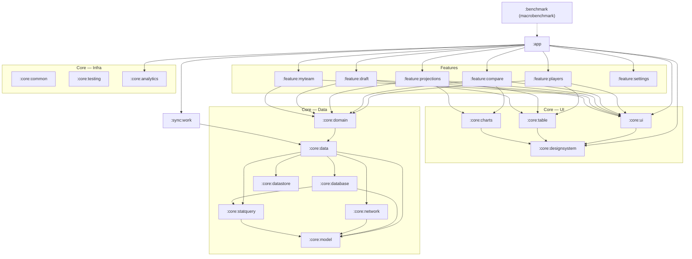

# Android Architecture — Free, Stat-Dense NFL Fantasy Prediction App

**Date:** 2026-09-22
**Stack (fixed):** Kotlin + Jetpack Compose, offline-first, no paywall
**Defining feature:** huge sortable/filterable stat tables + rich player/team comparison

---

## 0. Executive summary of decisions

| Area | Decision | One-line reason |
|---|---|---|
| Architecture | NiA-style multi-module, MVVM + UDF (not a formal MVI framework) | Google-supported pattern, low ceremony, easy to staff |
| DI | **Hilt** (KSP) | Compile-time graph validation across ~18 modules; zero cold-start graph resolution |
| DB | **Room 3.x** (`androidx.room3`) + `RoomRawQuery` | Full raw-SQL escape hatch *and* codegen, prepopulated DB, Paging integration |
| Network | **Retrofit + OkHttp** + kotlinx.serialization converter | Android-only app; OkHttp cache/interceptors are worth more than KMP portability today |
| Serialization | **kotlinx.serialization** | Compiler plugin, no reflection, shared with Proto DataStore |
| Paging | **Paging 3**, only for player-week grain | Season aggregates (~3k rows) don't need it; player-week (~500k) does |
| Sync | **WorkManager** + delta cursor + bundled seed SQLite DB | First launch must be instant and offline |
| Nav | **Navigation 3** (stable Nov 2025) + `ListDetailSceneStrategy` | Back stack as state; list-detail is free |
| Charts | **Vico** primary + in-house `:core:charts` Canvas module | Vico has no radar/box-plot; those are ~80 lines of Canvas each |
| Table | **Custom `LazyLayout`** (pattern-matched on `LazyTable`), shared-ScrollState as v1 | Nothing first-party virtualizes both axes |

**Biggest risk:** see [§9](#9-the-single-biggest-technical-risk).

---

## 1. Overall architecture

### 1.1 Module graph



### 1.2 Module responsibilities

| Module | Type | Contents | Notable |
|---|---|---|---|
| `:app` | app | `MainActivity`, `NavDisplay`, app-level scaffolding, Hilt `@HiltAndroidApp` | Depends on every feature; nothing depends on it |
| `:core:model` | kotlin-jvm | Pure Kotlin data classes/value classes, `StatColumn` registry, enums | **No Android deps** → fast unit tests, fast compile |
| `:core:statquery` | kotlin-jvm | `StatQuerySpec`, `SortSpec`, `FilterSpec`, SQL builder, column whitelist | Pure logic, 100% unit testable, no DB dep. See [§3.4](#34-dynamic-query-construction) |
| `:core:database` | android-lib | Room 3 entities, DAOs, migrations, FTS, prepopulated-DB wiring | Owns **two** databases (see [§5.5](#55-two-databases-stats-vs-user)) |
| `:core:network` | android-lib | Retrofit services, DTOs, OkHttp config, `NetworkMonitor` | DTOs never leak past `:core:data` |
| `:core:datastore` | android-lib | Proto DataStore for column presets + Preferences DataStore for flags | |
| `:core:data` | android-lib | Repositories, DTO↔Entity↔Model mappers, `Synchronizer` | **Single source of truth = DB.** Network writes to DB; UI reads DB |
| `:core:domain` | kotlin-jvm | Use cases that combine repos (e.g. `GetComparableStatsUseCase`) | Thin; only where 2+ repos combine or logic is non-trivial |
| `:core:designsystem` | android-lib | Theme, color tokens, typography, `NflTheme`, atoms (buttons, chips) | Previews + Roborazzi screenshot tests live here |
| `:core:ui` | android-lib | Composables that know about `:core:model` (PlayerRow, TeamBadge, StatBadge) | Split from designsystem precisely because it *does* know models |
| `:core:table` | android-lib | The stat table engine: `StatTable`, `StatTableState`, frozen column, header, sort UI | The crown-jewel module. See [§3](#3-the-hard-problem-massive-stat-tables-in-compose) |
| `:core:charts` | android-lib | Vico wrappers + hand-rolled Canvas charts (sparkline, radar, box, percentile) | See [§4](#4-charting) |
| `:core:common` | kotlin-jvm | `Result` wrapper, dispatchers qualifiers, `Clock`, extension fns | |
| `:core:testing` | android-lib | Test doubles, `MainDispatcherRule`, fake repos, Roborazzi rules | `testFixtures`-style, consumed via `testImplementation` |
| `:core:analytics` | android-lib | Analytics interface + no-op/Firebase impls | Interface in `:core:analytics`, impl swapped in `:app` |
| `:feature:*` | android-lib | One screen family each: route, `ViewModel`, `UiState`, composables | Features never depend on each other |
| `:sync:work` | android-lib | `SyncWorker`, `SeedWorker`, `LiveScoreWorker`, `SyncInitializer` | Separated so `:app` isn't a dumping ground |
| `:benchmark` | test app | Macrobenchmark: startup + table-scroll baseline profile generation | |

**Rules to enforce with a Gradle check (or Konsist/Lint):**
1. `:feature:*` → `:feature:*` dependencies are **forbidden**. Cross-feature navigation goes through route keys declared in `:core:model` (or a tiny `:core:navigation`).
2. `:core:database`, `:core:network`, `:core:datastore` are **only** visible to `:core:data`. Features never see a DAO or a Retrofit service.
3. `:core:model` and `:core:statquery` stay `kotlin("jvm")` — no `android` plugin. This keeps the largest, most-churned logic on the fastest compile path and testable without Robolectric.

### 1.3 Build-logic convention plugins

Create a composite build at `build-logic/` (exactly as Now in Android does) with:

```
build-logic/convention/src/main/kotlin/
  AndroidApplicationConventionPlugin.kt      // nfl.android.application
  AndroidLibraryConventionPlugin.kt          // nfl.android.library
  AndroidLibraryComposeConventionPlugin.kt   // nfl.android.library.compose
  AndroidFeatureConventionPlugin.kt          // nfl.android.feature  (= library + compose + hilt + core:ui)
  AndroidHiltConventionPlugin.kt             // nfl.android.hilt
  AndroidRoomConventionPlugin.kt             // nfl.android.room     (KSP + schema export dir)
  JvmLibraryConventionPlugin.kt              // nfl.jvm.library
  AndroidTestConventionPlugin.kt             // nfl.android.test
```

A feature module's build file then collapses to ~10 lines. This is the single highest-leverage build investment in a 18-module project.

### 1.4 MVVM + UDF, not a formal MVI framework

**Recommendation: MVVM with strict unidirectional data flow.** Concretely:

```kotlin
// feature/players/PlayersViewModel.kt
@HiltViewModel
class PlayersViewModel @Inject constructor(
    private val playerStatsRepository: PlayerStatsRepository,
    private val presetRepository: ColumnPresetRepository,
    savedStateHandle: SavedStateHandle,
) : ViewModel() {

    // The single input: a query spec. Every user action mutates this.
    private val querySpec = MutableStateFlow(StatQuerySpec.default(season = CURRENT_SEASON))

    val uiState: StateFlow<PlayersUiState> = combine(
        querySpec,
        presetRepository.activePreset,
    ) { spec, preset -> spec to preset }
        .flatMapLatest { (spec, preset) ->
            playerStatsRepository.observeTable(spec, preset.columns)
        }
        .map<StatTablePage, PlayersUiState> { PlayersUiState.Success(it) }
        .catch { emit(PlayersUiState.Error(it.toUserMessage())) }
        .stateIn(
            scope = viewModelScope,
            started = SharingStarted.WhileSubscribed(5_000),
            initialValue = PlayersUiState.Loading,
        )

    // Events in, one method per intent. No `dispatch(Intent)` switch.
    fun onSortToggled(column: StatColumn, additive: Boolean) =
        querySpec.update { it.toggleSort(column, additive) }

    fun onFilterChanged(filter: FilterSpec) =
        querySpec.update { it.copy(filter = filter) }
}

sealed interface PlayersUiState {
    data object Loading : PlayersUiState
    data class Error(val message: String) : PlayersUiState
    data class Success(val page: StatTablePage) : PlayersUiState
}
```

**Why not full MVI (Orbit / MVIKotlin / a `reduce(state, intent)` loop)?**
- The app's state is *dominated by one object* — the query spec — and derived data flows from it. A reducer adds a layer of indirection over what is already a pure `StatQuerySpec -> StatQuerySpec` transform.
- MVI's win is replayable, loggable intent streams. For a free stat app that's not worth the boilerplate tax across 6 features.
- **But adopt MVI's two genuinely valuable constraints:** (a) UI state is a single immutable object per screen; (b) the UI never mutates state, it only sends events upward. Both are in the sketch above. That is 90% of the benefit at 10% of the cost.

**One-off events** (snackbars, "preset saved", navigation): use a `Channel(Channel.BUFFERED).receiveAsFlow()` exposed as `Flow<UiEvent>`, consumed with `LaunchedEffect` + `repeatOnLifecycle`. Do **not** put them in `UiState` as nullable fields — you will fight consumed-event bugs.

**Offline-first single source of truth.** The DB is the only thing the UI reads. Network never reaches the UI:

```
Retrofit DTO ──► Mapper ──► Room upsert ──► Room Flow ──► ViewModel ──► Compose
                               ▲
                        WorkManager SyncWorker
```

---

## 2. Library choices with justification

### 2.1 Dependency injection — **Hilt**

| | Hilt | Koin (4.x + Annotations) | Manual |
|---|---|---|---|
| Graph validation | Compile time | Runtime (annotations variant adds partial compile checks) | Compile time |
| Cold start cost | ~0 ms | ~30–80 ms at 500 bindings | ~0 ms |
| Clean build cost | +8–15 s (KSP) | ~0 s | 0 |
| Multi-module ergonomics | Excellent (`@InstallIn`, component scoping) | Good (module lists must be assembled) | Painful past ~6 modules |
| ViewModel/WorkManager integration | First-party (`@HiltViewModel`, `HiltWorkerFactory`) | Community | DIY factories |

**Decision: Hilt with KSP.** With ~18 modules, a DI mistake that surfaces at runtime on a user's Sunday morning is unacceptable for an app whose whole value is "it works offline right now." Compile-time validation is the deciding factor; the build-time tax is real but bounded and is paid by CI, not users. Hilt's `HiltWorkerFactory` also removes real friction from the WorkManager-heavy sync design in §5.

Concessions to build speed: KSP (never KAPT), `@Binds` over `@Provides` wherever possible, and keep `@Module`s in leaf modules so a change doesn't invalidate the whole graph.

### 2.2 Local database — **Room 3.x**, and why not SQLDelight

This is the most consequential choice, so the reasoning is spelled out.

**The thing that looks like it favors SQLDelight** — "heavy analytical queries with dynamic sorting/filtering over 200+ columns, raw SQL flexibility matters" — actually doesn't, on inspection:

- SQLDelight's core value is **compile-time-verified SQL** written in `.sq` files. But our sort/filter/column-projection is decided **at runtime** from user input. Compile-time verification cannot cover a query that doesn't exist until the user taps a header. SQLDelight in that situation drops to `driver.executeQuery(identifier = null, sql = builtString, ...)` with a hand-written row mapper — i.e. exactly the same amount of raw SQL as Room, minus Room's result mapping.
- Room 3's `@RawQuery` + `RoomRawQuery` gives **the same raw-SQL freedom** and still maps rows into `@Entity`/POJO types for free, still returns `Flow<T>` with correct invalidation, and still plugs into `PagingSource`.

**What Room gives that SQLDelight does not, and that this app specifically needs:**

1. `createFromAsset()` / `createFromFile()` — ship a prebuilt, pre-indexed SQLite file. Critical for §5. SQLDelight requires hand-rolling this.
2. `@Fts4` codegen for player search (if adopted), with content-table linkage.
3. First-party Paging 3 `PagingSource` generation, including from `@RawQuery`.
4. `@AutoMigration` with exported JSON schemas checked into git — season-to-season schema churn becomes reviewable diffs.
5. `InvalidationTracker` — Flow queries re-emit when the sync worker writes. SQLDelight has query notifications but Room's table-level tracking composes better with `@RawQuery` observed tables (you declare `observedEntities` on the DAO method).
6. Google-maintained, and Room 3.0 (Mar 2026) is the modernized, KSP-only, coroutines-first, KMP-capable line, so this is not a legacy bet.

**Room 3 gotchas to plan for (these are real breaking changes):**
- Coordinates are `androidx.room3:room3-*`, package `androidx.room3` — **it does not conflict with Room 2**, deliberately. Verify exact artifact spelling against the release page before committing.
- **`SupportSQLiteQuery` / `SupportSQLiteDatabase` are gone** from core APIs, replaced by the `androidx.sqlite` driver APIs (`SQLiteDriver`, `SQLiteStatement`). `@RawQuery` now takes `RoomRawQuery`. Any tutorial you find that uses `SimpleSQLiteQuery` is Room 2 — translate it.
- KSP only, Kotlin codegen only, no KAPT, no Java.
- Many APIs are `suspend` now.

**Decision: Room 3.x.** If Room 3's newness worries you on day 1, start on Room **2.8.x** with the `SQLiteDriver` APIs adopted (which is the documented migration on-ramp) and move to 3.x once the table feature stabilizes. Do **not** start on Room 2.6 `SupportSQLite` — that is writing code you already know you must rewrite.

**Native SQLite build:** use `androidx.sqlite:sqlite-bundled` (ships a known SQLite version with FTS5/JSON1 compiled in) rather than the OS SQLite. Reason: OS SQLite version varies wildly by OEM/API level, and you do not want a query plan or an FTS feature that works on a Pixel and fails on a 2021 Samsung. Cost: a few MB of native lib per ABI — acceptable, and it is 16 KB-page-aligned in current versions.

### 2.3 Networking — **Retrofit 3 + OkHttp 5**

| | Retrofit + OkHttp | Ktor Client |
|---|---|---|
| Android-only fit | Best-in-class | Good |
| Response caching | OkHttp `Cache`, RFC-compliant, battle-tested | Manual/plugin |
| Interceptors / auth / retry | Mature ecosystem (Chucker, Flipper, Stetho) | Thinner |
| KMP | No | Yes |
| Binary size | Small | Comparable |

**Decision: Retrofit + OkHttp with the kotlinx.serialization converter.** The app is Android-only by decision. OkHttp's disk cache, connection pooling, Brotli support, and `EventListener` instrumentation are directly useful for a delta-sync app on flaky stadium wifi. Revisit only if a genuine iOS target appears; the repository interface boundary makes that swap a `:core:network` rewrite, not an app rewrite.

Configure: `Cache(cacheDir, 20 MB)`, `HttpLoggingInterceptor` at `BASIC` in debug only, an `Interceptor` adding `If-None-Match`/`ETag`, `retryOnConnectionFailure = true`, and a `callTimeout` of 30 s so a stalled sync cannot pin a worker.

### 2.4 Serialization — **kotlinx.serialization**

Compiler-plugin based → no reflection, no `kapt`, R8-friendly, and it is the *same* library used for Proto DataStore schemas and for the on-disk cache of column presets. Moshi (with codegen) is fine but is a second tool for the same job and its Kotlin-reflect fallback is an R8 trap. `@Serializable` + `ignoreUnknownKeys = true` + `explicitNulls = false` on the `Json` instance — essential when a stats feed adds columns mid-season.

### 2.5 Paging — **Paging 3, selectively**

- **Player-week / play-by-play grain (≈300k–1M rows):** Paging 3 with `PagingSource` from a `@RawQuery` DAO, `PagingConfig(pageSize = 60, prefetchDistance = 120, enablePlaceholders = true)`. Placeholders **on** — for a table, a stable scrollbar and stable row count matter more than the small extra work.
- **Season aggregate grain (≈2,500 rows/season):** do **not** page. Load the whole result into an `ImmutableList` and hand it to the table. 2,500 rows × 25 visible columns of pre-formatted strings is a few MB; the simplicity is worth it and sorting is instant.
- Paging interacts awkwardly with client-side re-sorting; because sorting is pushed into SQL (§3.4), each sort change is a new `PagingSource` — that's correct behaviour, just remember to `scrollToItem(0)` on sort change.

### 2.6 Everything else

| Concern | Choice | Notes |
|---|---|---|
| Background work | **WorkManager** | `enqueueUniquePeriodicWork` + `ExistingPeriodicWorkPolicy.KEEP`; `HiltWorkerFactory`; expedited work for FCM-triggered live updates |
| Preferences | **DataStore** — Preferences for flags, **Proto** for column presets | Presets are structured (ordered column list, widths, sort stack) → Proto with kotlinx.serialization or protobuf-lite |
| Navigation | **Navigation 3** (`androidx.navigation3`, stable 1.0.0 Nov 2025) | Back stack is a `NavBackStack` you own; `ListDetailSceneStrategy` from `material3-adaptive` gives tablet list-detail nearly free. Conservative fallback: Navigation Compose 2.9 with type-safe `@Serializable` routes |
| Image loading | **Coil 3** | Compose-first, Ktor/OkHttp-pluggable; headshots + team logos. Use `AsyncImage` with an explicit `size()` to avoid re-decoding on scroll |
| Immutable collections | **kotlinx-collections-immutable** | `ImmutableList<StatCell>` for Compose stability — see §3.3 |
| Concurrency | Coroutines + Flow | Inject `@Dispatcher(IO)`/`@Dispatcher(Default)` qualifiers, never hardcode `Dispatchers.IO` |
| Testing | JUnit 5 (`de.mannodermaus.android-junit5`) for JVM; JUnit 4 for instrumented | AndroidX test runners are still JUnit4-based — don't fight it |
| Flow testing | **Turbine** | `uiState.test { ... }` |
| Android-in-JVM | **Robolectric** | Fast repo/DAO tests without a device |
| Compose UI test | `createAndroidComposeRule`, `composeTestRule.onNodeWithTag` | Give every table cell a `testTag` of `"cell_${playerId}_${columnId}"` |
| Screenshot test | **Roborazzi** (primary), Paparazzi (optional) | Roborazzi runs on Robolectric → real Android runtime, Hilt, interaction *then* capture. Paparazzi is faster (pure layoutlib) but can't drive interactions; use it only for `:core:designsystem` atoms |
| Benchmark | `androidx.benchmark:benchmark-macro-junit4` | Baseline + startup profiles, and a `scrollStatTable` benchmark gating regressions |
| Static analysis | Detekt (with `detekt-compose` rules) + Android Lint + `compose-rules` (Twitter/slack ruleset) | Catches unstable params, missing `Modifier` params, `@Composable` returning non-Unit |

---

## 3. The hard problem: massive stat tables in Compose

### 3.0 Framing

There is **no first-party Compose primitive that virtualizes both axes.** `LazyColumn` virtualizes rows; `LazyRow` virtualizes columns; there is no `LazyGrid` with independent 2D scrolling and pinned edges. This is the central engineering problem of the app, and it deserves its own module (`:core:table`) and its own benchmark.

### 3.1 The anatomy of the layout

Four regions, three scroll relationships:

```
┌───────────────┬──────────────────────────────────────────────┐
│               │  ◄── shared horizontal scroll ──►            │
│   CORNER      │   HEADER ROW                                 │   pinned vertically
│  (static)     │   [ PPG ][ Tgt ][ aDOT ][ YAC ][ TD ] ...    │
├───────────────┼──────────────────────────────────────────────┤
│  NAME COLUMN  │   DATA GRID                                  │
│  (frozen X)   │   [ 24.3 ][ 9.1 ][ 11.2][ 4.4 ][ 0.6] ...    │   ▲
│  Josh Allen   │   [ 21.8 ][ 8.4 ][ 10.9][ 5.1 ][ 0.5] ...    │   │ shared
│  Lamar Jackson│   [ 20.1 ][ 7.9 ][  9.8][ 3.9 ][ 0.4] ...    │   │ vertical
│  ...          │   ...                                        │   ▼ scroll
└───────────────┴──────────────────────────────────────────────┘
```

- Header row and data grid share **one horizontal scroll state**.
- Name column and data grid share **one vertical scroll state**.
- Corner is static.

### 3.2 Two implementations, and when to use which

#### Tier 1 (ship this first): `LazyColumn` + one hoisted `ScrollState`

```kotlin
@Composable
fun StatTable(
    rows: ImmutableList<StatRow>,
    columns: ImmutableList<StatColumn>,
    nameColumnWidth: Dp,
    onSortToggle: (StatColumn, Boolean) -> Unit,
    modifier: Modifier = Modifier,
) {
    // ONE ScrollState, hoisted above LazyColumn. Every row and the header use it.
    // Rows entering composition mid-scroll are already at the correct offset.
    val hScroll = rememberScrollState()
    val vScroll = rememberLazyListState()

    Column(modifier) {
        // ── Header: corner + horizontally scrolling header cells ──────────
        Row(Modifier.height(48.dp)) {
            CornerCell(Modifier.width(nameColumnWidth))
            Row(
                Modifier
                    .horizontalScroll(hScroll)   // same state as the body rows
                    .height(48.dp)
            ) {
                columns.fastForEach { col ->
                    HeaderCell(
                        column = col,
                        onClick = { additive -> onSortToggle(col, additive) },
                        modifier = Modifier.width(col.width),
                    )
                }
            }
        }
        HorizontalDivider()

        // ── Body ──────────────────────────────────────────────────────────
        LazyColumn(state = vScroll) {
            items(
                items = rows,
                key = { it.playerId },          // stable identity across re-sorts
                contentType = { "statRow" },    // one type → maximal subcomposition reuse
            ) { row ->
                StatRowItem(
                    row = row,
                    columns = columns,
                    hScroll = hScroll,
                    nameColumnWidth = nameColumnWidth,
                )
            }
        }
    }
}

@Composable
private fun StatRowItem(
    row: StatRow,
    columns: ImmutableList<StatColumn>,
    hScroll: ScrollState,
    nameColumnWidth: Dp,
) {
    Row(Modifier.height(52.dp).semantics(mergeDescendants = true) {
        contentDescription = row.accessibilityLabel   // precomputed, see §6.1
    }) {
        // Frozen cell: OUTSIDE the horizontally scrolling Row → stays put.
        NameCell(row, Modifier.width(nameColumnWidth))

        Row(Modifier.horizontalScroll(hScroll)) {
            columns.fastForEach { col ->
                StatCellView(
                    cell = row.cells[col.index],   // PRE-FORMATTED string + heat value
                    modifier = Modifier.width(col.width),
                )
            }
        }
    }
}
```

**Why a single shared `ScrollState` and not per-row `LazyRow`s:**
- With per-row `LazyRow`s you have N independent `LazyListState`s. Synchronizing them requires a `snapshotFlow` fan-out and `scrollToItem(index, offset)` on every frame for every row. That produces feedback loops (row A's programmatic scroll notifies the source, which re-notifies A), visible tearing between rows during fling, and N independent flings. **Do not do this.** It is the single most common way teams get this wrong.
- One `ScrollState` means one fling, one velocity, zero synchronization code, and perfect alignment by construction.

**The cost you are accepting:** `Modifier.horizontalScroll` is **not lazy on the X axis**. Every visible row composes, measures, and lays out *all* its cells, even off-screen ones. At 20 visible rows × 200 columns that's 4,000 cell composables — unshippable.

**Therefore Tier 1 is only valid under a hard constraint: cap the number of simultaneously visible columns.** This is not a workaround, it is good product design — nobody reads 200 columns at once. Enforce:
- Default preset: 8–12 columns.
- Hard cap: **25 columns**, with UI that says "Showing 25 of 214 — edit columns."
- At 20 rows × 25 columns = 500 lightweight cells, this scrolls at 120 Hz on midrange hardware if §3.3 is followed.

#### Tier 2 (build when you need >25 columns or 120 Hz on low-end): custom `LazyLayout`

When the cap becomes a product problem, the answer is a `LazyLayout` with a two-dimensional item provider. Reference implementation to study (and a legitimate dependency): **`io.github.oleksandrbalan:lazytable`** (Apache-2.0, built on MinaBox/`LazyLayout`, supports `pinConfiguration` for frozen rows/columns, Android + CMP). It does exactly the right thing: one `LazyTableState`, one fling on a 2D plane, and only cells inside the viewport are composed.

Caveats before you `implementation` it: single-maintainer project, ~58 commits. **Recommendation: vendor it into `:core:table` (Apache-2.0 permits this, keep the NOTICE) or treat it as a design reference and write your own ~400-line `LazyLayout`.** You cannot have your app's defining feature blocked on an unresponsive upstream.

Sketch of the shape (this is what `LazyTable` does under the hood):

```kotlin
@Composable
fun StatLazyTable(state: StatTableState, content: StatTableScope.() -> Unit) {
    val itemProvider = rememberStatTableItemProvider(content)
    LazyLayout(itemProvider = { itemProvider }) { constraints ->
        // 1. From state.offsetX/offsetY + column widths + row height,
        //    compute the visible column range and row range (pure arithmetic —
        //    fixed row height makes this O(1) instead of a running sum).
        val visibleCols = state.visibleColumnRange(constraints.maxWidth)
        val visibleRows = state.visibleRowRange(constraints.maxHeight)

        // 2. Measure ONLY cells in that rectangle, plus pinned column cells.
        val placeables = buildList {
            for (r in visibleRows) for (c in visibleCols) {
                add(Triple(r, c, measure(itemProvider.indexOf(r, c), cellConstraints).first()))
            }
            for (r in visibleRows) { /* pinned name cells */ }
        }

        layout(constraints.maxWidth, constraints.maxHeight) {
            // 3. Place at (colOffset - scrollX, rowOffset - scrollY);
            //    pinned cells ignore scrollX and get a higher zIndex.
        }
    }
}
```

Key details that make or break it:
- **Fixed row height.** Uniform row height turns "which rows are visible" into division instead of a prefix-sum scan. Accept variable *column* widths (cached prefix-sum array), never variable row heights.
- Scroll via `Modifier.scrollable(Orientation.Horizontal) + scrollable(Orientation.Vertical)` composed, or a single `pointerInput` with a 2D `Animatable` + `splineBasedDecay` for fling.
- Store scroll offsets as `mutableFloatStateOf` and read them **in the measure/layout lambda only** — never in a composable body.

### 3.3 Performance rules (non-negotiable for `:core:table`)

**1. Pre-format everything off the main thread.**
The #1 jank source in stat tables is `String.format("%.1f", x)` / `NumberFormat` inside a cell composable. Formatting happens in the mapper, on `Dispatchers.Default`, once per data emission:

```kotlin
@Immutable
data class StatRow(
    val playerId: Int,
    val name: String,
    val teamAbbr: String,
    val position: Position,
    val accessibilityLabel: String,     // precomputed, see §6.1
    val cells: ImmutableList<StatCell>, // parallel to the visible column list
)

// value class → no allocation per cell; heat is a precomputed 0..1 percentile
@Immutable
data class StatCell(
    val text: String,       // already formatted: "24.3", "—", "12.5%"
    val heat: Float,        // 0f..1f, or Float.NaN for "no heat"
    val emphasis: Emphasis, // Normal / Leader / Negative
)
```

**2. Stability.** Strong skipping (default since Kotlin 2.0's Compose compiler) will skip composables whose params are *reference-equal* even when unstable — but that only helps if you **reuse instances**. So:
- Annotate `@Immutable` on all row/cell types.
- Use `ImmutableList`/`PersistentList` from kotlinx-collections-immutable, **not** `List<T>` (which Compose treats as unstable).
- In the mapper, when a sort changes but the data doesn't, **reuse the same `StatRow` instances** in a re-ordered list. Then only the list identity changes; every row skips recomposition and Compose just moves them.
- Add `enableStrongSkippingMode`/metrics: turn on Compose compiler metrics reports in a CI job and fail the build if a `:core:table` composable becomes non-skippable.

**3. `key` and `contentType`.** `key = { it.playerId }` is mandatory — without it, re-sorting recomposes every visible row instead of moving them, and any per-row `remember` state (expanded, selected) attaches to the wrong player. `contentType = { "statRow" }` lets Compose reuse subcompositions.

**4. Deferred state reads.** Anything that changes every frame must be read in the layout or draw phase, not composition:
- Header/body sync: sharing one `ScrollState` via `Modifier.horizontalScroll` already does this correctly.
- Manual sync (Tier 2, or a scroll-position indicator): use `Modifier.graphicsLayer { translationX = -state.offsetX }` or `Modifier.offset { IntOffset(-state.offsetX.roundToInt(), 0) }` — **lambda-taking overloads**. `Modifier.offset(x = state.offsetX.dp)` recomposes every frame; the lambda version does not.
- Heat-map backgrounds: `Modifier.drawBehind { drawRect(heatColor) }`, not `Modifier.background(heatColor)` when the color derives from changing state.

**5. `derivedStateOf`** for booleans computed from high-frequency state:
```kotlin
val showScrollToTop by remember { derivedStateOf { vScroll.firstVisibleItemIndex > 10 } }
val isScrolledRight by remember { derivedStateOf { hScroll.value > 0 } }  // drives the frozen-column shadow
```
Without this, the frozen-column elevation shadow recomposes on every scroll pixel.

**6. Defer chart/sparkline work during fling.** If cells contain sparklines, gate them:
```kotlin
val isSettled by remember { derivedStateOf { !vScroll.isScrollInProgress } }
```
and draw a flat placeholder while scrolling.

**7. Baseline + startup profiles.** Add a `:benchmark` macrobenchmark module with:
- `startupCompilationMode = CompilationMode.None()` for a cold-start baseline.
- A `BaselineProfileGenerator` that launches the app, opens the players table, scrolls **vertically and horizontally**, changes sort, and opens player detail. The table code paths are exactly the ones that benefit most from AOT.
- Ship via `androidx.baselineprofile` Gradle plugin; verify with `ProfileVerifier` in a debug overlay.
- Realistic expectation: 20–35% faster first-scroll frames on the table.

**8. R8 config.**
- `android.enableR8.fullMode=true` (default in AGP 8+).
- Keep rules only for: Room entities used via `@RawQuery` reflection-free mapping (Room generates code; usually no rule needed), kotlinx.serialization (`@Serializable` classes are handled by the plugin's consumer rules), and any `Class.forName` in analytics.
- **Do not** add blanket `-keep class com.yourapp.** { *; }` — it is the most common cause of a 40% larger APK.
- Enable resource shrinking + `android.enableResourceOptimizations`.
- Run `./gradlew :app:bundleRelease` and inspect with `apkanalyzer` in CI; fail on >5% size regression.

### 3.4 Dynamic query construction

**Decision: Room 3 `@RawQuery` + `RoomRawQuery`, with a pure-Kotlin builder in `:core:statquery`.**

The critical safety property: **column names are never strings from the UI.** They come from a sealed, compile-time registry. Values are always bound as `?`.

```kotlin
// :core:model — the whitelist. One entry per stat, ~214 of them.
@Immutable
data class StatColumn(
    val id: StatColumnId,          // enum or value class
    val sqlExpr: String,           // "ps.targets", or "ps.rec_yards * 1.0 / NULLIF(ps.targets,0)"
    val header: String,            // "Tgt"
    val longName: String,          // "Targets"
    val format: StatFormat,        // Integer / OneDecimal / Percent / Ordinal
    val higherIsBetter: Boolean,   // drives heat-map direction
    val width: Dp,
)

object StatColumns {
    val PPG = StatColumn(StatColumnId.PPG, "ps.fantasy_points / NULLIF(ps.games,0)", "PPG", ...)
    val TARGETS = StatColumn(StatColumnId.TARGETS, "ps.targets", "Tgt", ...)
    // ...
    val byId: Map<StatColumnId, StatColumn> = /* built once */
}
```

```kotlin
// :core:statquery — pure Kotlin, zero Android deps, 100% unit tested.
data class SortKey(val column: StatColumn, val descending: Boolean)

sealed interface FilterClause {
    data class InPositions(val positions: List<Position>) : FilterClause
    data class InTeams(val teams: List<String>) : FilterClause
    data class Range(val column: StatColumn, val min: Double?, val max: Double?) : FilterClause
    data class MinGames(val games: Int) : FilterClause
    data class NameStartsWith(val prefix: String) : FilterClause
}

data class StatQuerySpec(
    val season: Int,
    val weekRange: IntRange?,          // null = season aggregate
    val filters: List<FilterClause>,
    val sort: List<SortKey>,           // multi-column: sort[0] is primary
    val visibleColumns: List<StatColumn>,
    val limit: Int = 500,
    val offset: Int = 0,
)

/** Output is a SQL string with only `?` placeholders, plus the ordered binder list. */
data class BuiltQuery(val sql: String, val binders: List<Binder>)

sealed interface Binder {
    data class L(val v: Long) : Binder
    data class D(val v: Double) : Binder
    data class S(val v: String) : Binder
}

fun StatQuerySpec.build(): BuiltQuery {
    val binders = mutableListOf<Binder>()
    val select = buildString {
        append("SELECT ps.player_id, p.full_name, p.position, t.abbr")
        visibleColumns.forEach { col -> append(", ").append(col.sqlExpr).append(" AS ").append(col.id.name) }
    }

    val where = mutableListOf("ps.season = ?").also { binders += Binder.L(season.toLong()) }
    weekRange?.let {
        where += "ps.week BETWEEN ? AND ?"
        binders += Binder.L(it.first.toLong()); binders += Binder.L(it.last.toLong())
    }
    filters.forEach { f ->
        when (f) {
            is FilterClause.InPositions -> {
                where += "p.position IN (${f.positions.joinToString(",") { "?" }})"
                f.positions.forEach { binders += Binder.S(it.name) }
            }
            is FilterClause.Range -> {
                f.min?.let { where += "(${f.column.sqlExpr}) >= ?"; binders += Binder.D(it) }
                f.max?.let { where += "(${f.column.sqlExpr}) <= ?"; binders += Binder.D(it) }
            }
            is FilterClause.MinGames -> { where += "ps.games >= ?"; binders += Binder.L(f.games.toLong()) }
            is FilterClause.NameStartsWith -> {
                // indexed prefix search; see §3.6
                where += "p.search_name >= ? AND p.search_name < ?"
                binders += Binder.S(f.prefix); binders += Binder.S(f.prefix + '￿')
            }
            is FilterClause.InTeams -> {
                where += "t.abbr IN (${f.teams.joinToString(",") { "?" }})"
                f.teams.forEach { binders += Binder.S(it) }
            }
        }
    }

    // ORDER BY: identifiers come ONLY from the registry — never from user text.
    // NULLS LAST so "no data" sinks regardless of direction.
    val orderBy = (sort.ifEmpty { listOf(SortKey(StatColumns.PPG, descending = true)) })
        .joinToString(", ") { k ->
            "(${k.column.sqlExpr}) IS NULL, (${k.column.sqlExpr}) ${if (k.descending) "DESC" else "ASC"}"
        } + ", p.full_name ASC"   // deterministic tiebreak → stable paging

    binders += Binder.L(limit.toLong()); binders += Binder.L(offset.toLong())

    return BuiltQuery(
        sql = """
            $select
            FROM player_season_stats ps
            JOIN player p ON p.player_id = ps.player_id
            JOIN team t   ON t.team_id  = ps.team_id
            WHERE ${where.joinToString(" AND ")}
            ORDER BY $orderBy
            LIMIT ? OFFSET ?
        """.trimIndent(),
        binders = binders,
    )
}
```

```kotlin
// :core:database — Room 3 execution. NOTE: RoomRawQuery, not SupportSQLiteQuery.
fun BuiltQuery.toRoomRawQuery(): RoomRawQuery = RoomRawQuery(
    sql = sql,
    onBindStatement = { stmt ->
        binders.forEachIndexed { i, b ->
            val idx = i + 1
            when (b) {
                is Binder.L -> stmt.bindLong(idx, b.v)
                is Binder.D -> stmt.bindDouble(idx, b.v)
                is Binder.S -> stmt.bindText(idx, b.v)
            }
        }
    },
)

@Dao
interface StatTableDao {
    // observedEntities is REQUIRED for Flow invalidation on a raw query.
    @RawQuery(observedEntities = [PlayerSeasonStatsEntity::class, PlayerEntity::class])
    fun observeTable(query: RoomRawQuery): Flow<List<StatTableRowProjection>>

    @RawQuery(observedEntities = [PlayerWeekStatsEntity::class])
    fun pagedTable(query: RoomRawQuery): PagingSource<Int, StatTableRowProjection>
}
```

Because the projection has a variable column list, map it with a small cursor-walking mapper or declare `StatTableRowProjection` with the fixed identity columns plus a `Map<String, Double?>`-style accessor. Simplest robust approach: return `List<Array<Any?>>`-shaped rows via a `@DaoReturnTypeConverter` (new in Room 3) or read the `SQLiteStatement` directly in a `@Transaction`-wrapped DAO function and build `StatRow` objects yourself — you are formatting them anyway (§3.3 rule 1).

**Unit-test the builder exhaustively** — golden-file tests comparing generated SQL, plus a fuzz test asserting the SQL never contains a character that came from user input.

### 3.5 Multi-column sorting UI

Model: `sort: List<SortKey>`, primary first, cap at 3.

Interaction:
- **Tap header** → cycle `desc → asc → off` for that column, *replacing* the sort stack.
- **Long-press header** (or tap while a "multi-sort" mode chip is active) → *append* to the sort stack.
- Header shows a direction glyph plus a small superscript rank when >1 key: `PPG ▼¹`, `Age ▲²`.
- A chip row above the table shows the active sort stack with drag-to-reorder and an × per chip. This is the discoverable path; the long-press is the power-user path.
- `stateDescription` on each header for TalkBack: `"sorted descending, sort priority 1 of 2"`.

On sort change: `LaunchedEffect(sortSpec) { vScroll.scrollToItem(0) }`.

### 3.6 Fast filtering over tens of thousands of rows

**Data volumes to plan for (per season):** ~2,000 players, ~1,800 player-season rows for fantasy-relevant players, ~30,000–60,000 player-week rows, and optionally ~50,000 play-level rows. Across 10 seasons of history: ~500k player-week rows. That is *small* for SQLite — with correct indexes, every query here should be <30 ms. The risk is not volume, it is **query plans**.

**Indexing strategy:**

```sql
-- Identity / join
CREATE INDEX idx_pws_player_season_week ON player_week_stats(player_id, season, week);
CREATE INDEX idx_pss_season_pos         ON player_season_stats(season, position);

-- Covering index for the default table view (season + position filter, PPG sort).
-- Covering = the index contains every column the query touches → no table lookup.
CREATE INDEX idx_pss_cover_default ON player_season_stats(
    season, position, fantasy_points_ppg DESC, player_id, games, targets, rec_yards
);

-- Partial indexes for the hot filters. Tiny, and dramatically narrow the scan.
CREATE INDEX idx_pss_current ON player_season_stats(position, fantasy_points_ppg DESC)
    WHERE season = 2026;
CREATE INDEX idx_pss_qualified ON player_season_stats(season, position, fantasy_points_ppg DESC)
    WHERE games >= 4;

-- Prefix search on a normalized name (see below)
CREATE INDEX idx_player_search_name ON player(search_name);
```

**The honest limitation:** you cannot index 214 columns × 2 directions. Arbitrary sorts will fall back to a filesort. That is *fine* if the filtered row set is small (a few thousand). Enforce it in product: the table always has an implicit `season` (and usually `position`) filter, so the sort operates over ≤2,500 rows. Sorting 2,500 rows in SQLite is sub-millisecond. **Never let the user reach "all seasons, all positions, sort by an obscure column" without a `LIMIT`.**

**Precompute aggregates — yes, definitively.** Do not compute season aggregates from player-week rows at query time.
- `player_season_stats` — materialized, one row per player-season-team, ~40 core stats as real columns plus a `stats_json` blob for the long tail.
- `player_last_n_stats(player_id, season, window)` for L3/L5/L8 splits — these are what fantasy users actually sort by, and computing them from week rows with window functions on every scroll is the difference between 5 ms and 400 ms.
- `player_percentile(player_id, season, column_id, pct)` — precompute percentiles for the heat map and radar charts. Computing `PERCENT_RANK()` over 214 columns at query time is not viable; computing it once at sync time is trivial.
- These are built **server-side** and shipped in the prebuilt DB (§5), not computed on device. On-device recomputation is only needed for live in-progress weeks.

**Column layout decision — wide table, not EAV.** A 214-column table feels wrong but is the right call: EAV (`player_id, stat_id, value`) turns every multi-column sort into 214 self-joins or a pivot. SQLite handles wide tables fine (limit is 2,000 columns by default). Compromise actually recommended: **~50 hot columns as real columns** (everything anyone sorts by), **the remaining ~165 in a JSON1 blob** extracted with `json_extract(stats_json, '$.air_yards_share')` for the rare detail views. Sorting on a JSON-extracted column is slow — so if a JSON column becomes popular, promote it to a real column in the next migration. Track this with analytics on sort usage.

**Pragmas** (set in a `RoomDatabase.Callback.onOpen`):
```sql
PRAGMA journal_mode = WAL;
PRAGMA synchronous = NORMAL;
PRAGMA temp_store = MEMORY;
PRAGMA cache_size = -8000;      -- 8 MB page cache
PRAGMA mmap_size = 134217728;   -- 128 MB
PRAGMA foreign_keys = ON;
```
Run `ANALYZE` once after the seed DB is installed and after any bulk sync — SQLite's query planner is materially better with `sqlite_stat1` populated. Better yet: run `ANALYZE` on the **server** before shipping the prebuilt DB so the stats travel with it.

**FTS — probably not, and that's the interesting finding.** There are ~2,000–3,000 active NFL players. For type-ahead on that set:
- A normalized `search_name` column (lowercased, diacritics stripped, `"Amon-Ra St. Brown"` → `"amon ra st brown"`) plus a B-tree index, queried with the range trick `search_name >= 'st' AND search_name < 'st￿'` (which **uses the index**, unlike `LIKE '%st%'`) is <1 ms and ~0 bytes of extra schema.
- Add a second row per player for the last name so `"brown"` matches, or store a `search_tokens` table with one row per token.
- **Adopt FTS4/FTS5 only when you add free-text search over news, injury notes, or analyst blurbs.** At that point use `@Fts4` (Room has `@Fts3`/`@Fts4` annotations; FTS5 requires a raw `CREATE VIRTUAL TABLE` in a migration) with `prefix='2,3'` for type-ahead, and an external-content table to avoid duplicating text.

This is a real simplification: many teams reach for FTS reflexively and pay for a virtual table, triggers, and rebuild cost to search 3,000 short strings.

### 3.7 Column customization and presets

**Data model** (Proto DataStore, `:core:datastore`):
```protobuf
message ColumnPreset {
  string id = 1;
  string name = 2;                 // "My WR view"
  repeated string column_ids = 3;  // ordered; maps to StatColumnId
  map<string, float> widths = 4;   // overrides, in dp
  repeated SortKeyProto sort = 5;
  FilterSpecProto filter = 6;
  int64 updated_at = 7;
}
message ColumnPresetStore {
  repeated ColumnPreset presets = 1;
  string active_preset_id = 2;
}
```

**Ship built-in presets** and make them the default experience: "Standard", "PPR", "Volume (targets/carries/snaps)", "Efficiency (YPRR, aDOT, EPA)", "Red Zone", "Matchup". Users who never open the column editor still get a great table. Built-ins are immutable; "Edit" forks to a user copy.

**Picker UI:** a bottom sheet (or the detail pane on tablet) with two sections — "Visible" (reorderable, with a drag handle and an × ) and "Available" grouped by category (Passing / Rushing / Receiving / Advanced / Projection / Matchup), with a search field over `longName`. Reordering: `sh.calvin.reorderable` (Apache-2.0, actively maintained, Compose-native) or `Modifier.pointerInput` + `detectDragGesturesAfterLongPress` + `animateItem()`.

**Column widths:** persist per column, but compute the *default* width by measuring the widest formatted value (§6.3) rather than hardcoding dp — otherwise font scaling clips numbers.

**Sharing presets:** encode the preset as a short base64 of the proto in a deep link (`nflapp://preset?d=...`). Free, no backend, and it's excellent organic growth for a no-paywall app.

---

## 4. Charting

### 4.1 Evaluation

| Library | License | Maintenance | Compose-native | Has what we need? |
|---|---|---|---|---|
| **Vico** (patrykandpatrick) | Apache-2.0 | Active (3.2k★, ~3,200 commits, 2.x/3.x line, CMP) | Yes (first-class) | Line, column, candlestick, point/scatter, composed/layered charts, axes, markers, scroll+zoom, async model transforms. **No radar, no box plot** |
| **YCharts** (Yaccounts/codeandtheory) | Apache-2.0 | Slowed noticeably | Yes | Line, bar, pie, donut, wave, bubble. No radar/box. Limited theming |
| **Compose-Charts** (ehsannarmani) | Apache-2.0 | Active, growing | Yes | Line, column, row, pie. Pleasant API. No radar/box/scatter |
| **MPAndroidChart** | Apache-2.0 | **Effectively unmaintained** (last meaningful release ~2021) | No — needs `AndroidView` | Radar + candle + scatter exist, but View interop inside a `LazyColumn` is a real cost, and it pulls a View-system dependency into a Compose-only app |
| **Hand-rolled Canvas** | — | You | Yes | Anything, at ~50–150 lines per chart type |

### 4.2 Recommendation

**Primary: Vico.** For anything with axes and a time/category domain — weekly fantasy point trend lines, target-share bars, snap-count columns, scatter of aDOT vs. catch rate, usage-vs-efficiency quadrant plots. Reasons: Apache-2.0, genuinely active maintenance, Compose-first (no View interop), and — important for this app — its `CartesianChartModelProducer` performs data transforms **off the main thread**, which matters when a chart's data changes as the user drags a comparison slider.

**Secondary (and it is not a fallback, it is a required build): an in-house `:core:charts` module of Canvas composables.** The chart types this app most distinctively needs are precisely the ones Vico lacks:

| Chart | Build | Rough effort |
|---|---|---|
| **Sparkline** (in-cell, 8-week trend) | Canvas | ~40 lines. Must be dirt cheap — pre-compute the normalized `List<Offset>` in the mapper, draw with one `Path`. Never use a chart library inside a table cell |
| **Radar / spider** (player comparison across 6–8 percentile axes) | Canvas | ~120 lines: polygon grid, axis labels, 2–3 overlaid `Path`s with `alpha`, animated via `animateFloatAsState` on a 0..1 morph factor |
| **Percentile bar** (single stat vs. position cohort) | Canvas | ~50 lines: track, fill to percentile, tick at median, label |
| **Box plot** (weekly distribution / floor-ceiling) | Canvas | ~90 lines: box, whiskers, median line, outlier dots |
| **Scatter** | Vico point layer, or Canvas if you need lasso selection | — |
| **Bar / line** | Vico | — |

Writing these yourself is genuinely cheaper than adopting a second charting dependency, and it means the comparison views — the app's second differentiator — are not hostage to someone else's roadmap. Put a shared `ChartTheme` in `:core:designsystem` so hand-rolled and Vico charts look identical.

**Explicitly reject MPAndroidChart.** Its radar chart is the only reason to consider it, and interop cost + abandonment risk outweigh ~120 lines of Canvas.

### 4.3 Chart design rules for a stat app

- **Colorblind-safe by default.** Never encode good/bad as red/green. Use a diverging **blue ↔ orange** ramp (e.g. `#2166AC` → `#F7F7F7` → `#B35806`), which is distinguishable under deuteranopia and protanopia. Categorical series: use a 6-colour CVD-safe set (Okabe–Ito) and never more than 6 series.
- **Redundant encoding.** In heat-mapped table cells the number is always legible on top of the fill; color is secondary. Add an optional "value bars" mode (bar length inside the cell) for users who want a non-color channel.
- **Settings toggle:** "Heat map: Color / Bars / Off" plus "High contrast". This is ~20 lines and covers most CVD complaints.
- Always pair a chart with an accessible text alternative (§6.2).

---

## 5. Offline-first sync design

### 5.1 The governing requirement

> A user opens the app at 12:55 PM on Sunday in a stadium with no usable network. Everything must work.

That single requirement dictates every choice below.

### 5.2 Ship a prebuilt SQLite file, not JSON

**Decision: bundle a precomputed, pre-indexed, `ANALYZE`d SQLite database.**

Why not JSON-then-insert:
- ~500k player-week rows from JSON = parse + 500k inserts + index builds. Even batched in a transaction, that is 20–90 seconds and meaningful battery on midrange hardware, on **first launch**, which is exactly when you lose users.
- A prebuilt `.db` is a **file copy** — 1–3 seconds. Indexes are already built. `sqlite_stat1` is already populated.

Mechanism:
```kotlin
Room.databaseBuilder(context, StatsDatabase::class.java, "stats.db")
    .createFromAsset("database/stats_seed_v12.db")     // or createFromFile(downloadedFile)
    .setDriver(BundledSQLiteDriver())
    .addMigrations(*STATS_MIGRATIONS)
    .fallbackToDestructiveMigration(dropAllTables = true) // SAFE — see §5.5
    .build()
```

**Size strategy — this is where Play Asset Delivery earns its keep:**
- Bundle **current season + last season** only, gzipped, in an **install-time asset pack** (Play Asset Delivery). Keeps the base module small, keeps the seed out of the APK's compressed-resource path, and lets you push a new seed without a full app update via a fast-follow pack.
- Historical seasons (2015–2024) are a **downloadable** `.db.gz` per era, fetched on demand into `filesDir` and `ATTACH DATABASE`d, or merged. Most users never touch 2017 splits; don't make them carry it.
- Target: base AAB **< 25 MB**, install-time pack **< 40 MB**, so the install stays well under the cellular-download prompt and the app feels lightweight — which matters disproportionately for a free app competing on "just works."

### 5.3 Delta sync

Server contract:
```
GET /v1/delta?since=<cursor>&season=2026
→ { "cursor": "2026-09-22T17:04:11Z#4471",
    "upserts": { "player": [...], "player_week_stats": [...], "projections": [...] },
    "deletes": { "player_week_stats": [ids] },
    "full_refresh_required": false }
```
- `cursor` is opaque and monotonic; store it in Preferences DataStore per table group.
- `full_refresh_required: true` tells the client to discard `stats.db` and re-download a seed — your escape hatch for a schema change or a data-correction event.
- Apply upserts in **one transaction** per response page; only then persist the new cursor. Crash mid-apply → next run replays from the old cursor. Idempotent upserts make replays harmless.

Worker topology (`:sync:work`):

| Worker | Trigger | Constraints | Purpose |
|---|---|---|---|
| `SeedInstallWorker` | First launch (via `App Startup` / `Initializer`) | none | Copy/verify asset DB, run `ANALYZE` |
| `DeltaSyncWorker` | `PeriodicWorkRequest` every 6 h + on app foreground if stale >2 h | `NetworkType.CONNECTED`, `BatteryNotLow` | Normal delta pull |
| `GameDaySyncWorker` | Periodic every 1 h, **only Sun/Mon/Thu during season** | `CONNECTED` | Tighter cadence around games |
| `PrefetchWorker` | One-time, scheduled Sat ~11 PM local | `CONNECTED`, `DeviceIdle`, `BatteryNotLow` | **The Sunday insurance policy**: pull final projections, inactives, weather, matchup data so Sunday morning needs no network |
| `LiveScoreWorker` | Expedited one-time, triggered by an FCM data message at kickoff | `CONNECTED` | Not for polling — see §5.4 |

Single-flight: `WorkManager.enqueueUniqueWork("sync", ExistingWorkPolicy.KEEP, request)` and `enqueueUniquePeriodicWork(..., ExistingPeriodicWorkPolicy.KEEP, ...)`. Backoff: `BackoffPolicy.EXPONENTIAL, 30s`. Return `Result.retry()` on 5xx/IO, `Result.failure()` on 4xx (and log it — a persistent 4xx is a contract break you need to know about).

Adopt Now in Android's `Synchronizer` interface shape: a worker delegates to repositories that each implement `syncWith(synchronizer)`, reading/writing their own change-list version. It keeps sync logic in `:core:data` next to the repositories instead of in one god-worker.

### 5.4 Live games and cache invalidation

**WorkManager is the wrong tool for live scoring** — the minimum periodic interval is 15 minutes and expedited work has quotas. Use it only for the *transition* events (kickoff, final).

Live strategy:
- **Foreground polling while a live screen is visible.** A `LiveScoreRepository` exposes `Flow<LiveState>` backed by a loop that is started/stopped by `lifecycle.repeatOnLifecycle(STARTED)` in the feature's `LaunchedEffect`. Poll every 20–30 s, with jitter, and back off to 60 s when the app has been backgrounded-then-foregrounded repeatedly. Write results into a `live_stat` table so the rest of the app reads one source of truth.
- **Staleness metadata, not silent staleness.** Every syncable group has a row in `sync_meta(key, last_success_at, source)`. The UI renders "Updated 1:07 PM" or "Offline — as of Sat 11:58 PM" in a persistent, non-modal bar. For a stats app, *wrong-looking numbers with no explanation* is the worst failure mode; a timestamp converts a bug report into an understood state.
- **Invalidation:** the live table has a short TTL (2 min). On `DeltaSyncWorker` success, live rows for finished games are reconciled into `player_week_stats` and the live rows deleted. Room's `InvalidationTracker` propagates to every open `Flow` automatically — no manual cache busting.
- **Never block the table on network.** Every repository method reads the DB first and emits immediately; network is a side-effect that writes the DB. There is no "loading" state that gates the table once a seed exists.

### 5.5 Two databases: `stats.db` vs `user.db`

**This is the most important structural recommendation in this section.**

| | `stats.db` | `user.db` |
|---|---|---|
| Contents | Players, teams, all stats, projections, schedules, percentiles | Column presets, my team/roster, watchlist, notes, draft boards, settings |
| Provenance | Server — fully reconstructible | User — **irreplaceable** |
| Migration policy | `fallbackToDestructiveMigration(dropAllTables = true)` + re-seed | Hand-written `Migration`s, never destructive, `@AutoMigration` where possible |
| Season rollover | New seed file, drop and replace | Untouched |

Keeping these in one database forces you to write careful migrations for data you could simply re-download, and — far worse — makes it tempting to destructively migrate a database that holds a user's draft board. Split them on day one; merging later is impossible, splitting later is a painful data migration.

Cross-DB joins are not available, so `user.db` stores `player_id` references and the repository layer joins in Kotlin (or `ATTACH`es `stats.db` read-only for a specific query). At these row counts, joining in Kotlin is fine.

### 5.6 Season-to-season migrations

Design the schema so **a new season is data, not schema**: every stat table carries a `season INTEGER NOT NULL` column and no table or column name contains a year. Then the 2027 season is an insert, not a migration.

Schema *does* change when the league or your model adds a stat. Policy:
- New stat → new nullable column in `player_season_stats` if it's hot, otherwise a key in `stats_json`. `@AutoMigration` handles added nullable columns.
- Export Room schemas to `:core:database/schemas/` and **check them into git**. Review schema diffs in PRs.
- Bump the seed asset filename (`stats_seed_v12.db`) on every schema change so a stale asset can never be paired with a new schema.
- Keep a `db_meta(schema_version, seed_version, built_at, season)` table inside the seed; verify on open and force a re-seed on mismatch.

### 5.7 The Sunday-no-connection walkthrough

1. `PrefetchWorker` ran Saturday 11 PM on wifi: final projections, inactive designations, weather, Vegas lines, and opponent-rank data are in `stats.db`.
2. Sunday 12:55 PM, airplane-mode-grade signal. App cold-starts. Baseline profile makes it a ~400 ms cold start.
3. Every screen reads Room. Players table, projections, compare, draft board, my team: all render fully.
4. A single persistent bar reads **"Offline — data as of Sat 11:58 PM"** with a retry affordance.
5. `NetworkMonitor` (a `Flow<Boolean>` from `ConnectivityManager.NetworkCallback`) emits `true` the moment signal returns; the repository triggers an expedited `DeltaSyncWorker`; the bar becomes "Updating…" then "Updated 1:07 PM". No user action, no pull-to-refresh required (but offer it anyway — users expect it).
6. Live scoring is the only thing degraded, and it says so explicitly rather than showing zeros.

---

## 6. Accessibility and adaptive layout

The framing: this is a **data** app. Accessibility here is mostly *information design*, and the same work that makes it usable with TalkBack makes it usable on a phone in sunlight at 200% font scale. These are cheap and high-leverage.

### 6.1 Table semantics — the row is the node, not the cell

A naive `collectionItemInfo` per cell produces a 5,000-node accessibility tree and a TalkBack experience where reaching column 40 takes 40 swipes. Do this instead:

```kotlin
Row(
    Modifier
        .height(52.dp)
        .semantics(mergeDescendants = true) {
            // Precomputed in the mapper, off the main thread.
            contentDescription = row.accessibilityLabel
            // "Josh Allen, quarterback, Buffalo. Rank 2. 24.3 points per game,
            //  9.1 targets, 68 percent completion. Row 2 of 312."
            collectionItemInfo = CollectionItemInfo(
                rowIndex = row.index, rowSpan = 1, columnIndex = 0, columnSpan = 1
            )
            customActions = listOf(
                CustomAccessibilityAction("Read all stats") { openDetail(row.playerId); true },
                CustomAccessibilityAction("Compare") { addToCompare(row.playerId); true },
                CustomAccessibilityAction("Sort by this column") { /* ... */ true },
            )
        }
) {
    NameCell(row, ...)
    Row(Modifier.horizontalScroll(hScroll).clearAndSetSemantics { }) {  // cells invisible to a11y
        columns.fastForEach { StatCellView(...) }
    }
}
```

- `Modifier.semantics { collectionInfo = CollectionInfo(rowCount = rows.size, columnCount = 1) }` on the `LazyColumn` (columnCount 1 because we present rows as the unit).
- `clearAndSetSemantics {}` on the scrolling cell container removes per-cell noise.
- The `accessibilityLabel` includes only the **visible** columns, in order, with **long names and units** — `"9.1 targets"`, not `"9.1"`. This is the whole game: a content description that conveys data, not one that says "cell".
- Provide a per-row "Read all stats" custom action that opens the detail sheet, which is a *linear*, fully explorable presentation of all 214 stats grouped by category. That detail sheet is the accessible path to the full dataset; the table is the visual path.

Headers: `Modifier.semantics { heading(); stateDescription = "sorted descending, priority 1" }`, and each header must be its own focusable node with an `onClick` label of `"Sort by targets"`.

### 6.2 Chart semantics

Never ship an undescribed `Canvas`. Every chart gets:

```kotlin
Canvas(
    Modifier
        .fillMaxWidth()
        .height(180.dp)
        .semantics {
            contentDescription = chart.summary
            // "Line chart. Fantasy points, weeks 1 to 14. Trending up.
            //  Low 4.2 in week 3, high 31.1 in week 9, average 15.8.
            //  Last 3 weeks above season average."
        }
) { /* draw */ }
```
Generate `summary` programmatically from the series (min, max, mean, trend direction, notable recent movement) — a ~30-line function reused by every chart type. Additionally offer a **"View as table"** toggle on every chart; it costs almost nothing (you already have a table engine) and it is the genuinely accessible presentation for a screen-reader user, plus power users love it.

For radar comparisons: describe each axis and both players — `"Radar chart comparing Josh Allen and Lamar Jackson across 6 categories. Allen leads in passing yards, 88th versus 74th percentile, and ..."`.

### 6.3 Touch targets and font scaling

- **Row height ≥ 48 dp.** Header cells get `Modifier.minimumInteractiveComponentSize()`; if a column is visually 44 dp wide, expand the *touch* target without expanding the visual one.
- Sort chips, column-picker drag handles, and the ×-to-remove all need 48 dp targets — drag handles are the most common violation.
- **Font scaling is the table's real enemy.** Android 14+ supports non-linear scaling to 200%. A fixed `Modifier.width(56.dp)` + `maxLines = 1` column clips `"128.4"` into `"128."` at 200% — silently wrong data, which is worse than a broken layout.

Strategy:
```kotlin
@Composable
fun rememberColumnWidths(
    columns: ImmutableList<StatColumn>,
    sampleValues: Map<StatColumnId, String>,
): ImmutableList<Dp> {
    val measurer = rememberTextMeasurer()
    val density = LocalDensity.current
    val fontScale = LocalDensity.current.fontScale     // recompute when this changes
    val style = MaterialTheme.typography.bodyMedium
    return remember(columns, fontScale, style) {
        columns.map { col ->
            val widest = maxOf(
                measurer.measure(col.header, style).size.width,
                measurer.measure(sampleValues[col.id] ?: "888.8", style).size.width,
            )
            with(density) { widest.toDp() } + 16.dp    // padding
        }.toImmutableList()
    }
}
```
Plus: allow the row height to grow (`Modifier.heightIn(min = 48.dp)` instead of `.height(48.dp)`) — but keep it *uniform per table* by taking the max across visible rows, so the Tier-2 `LazyLayout` math stays O(1). Offer a **density toggle** ("Comfortable / Compact") that changes *padding*, never font size.

### 6.4 Colorblind-safe heat maps

Covered in §4.3. Summary: diverging blue↔orange, value always legible on top, optional bar-length mode, high-contrast setting, and never red/green for good/bad.

### 6.5 Adaptive layout

Use `material3-adaptive` (`adaptive`, `adaptive-layout`, `adaptive-navigation`) plus `material3-adaptive-navigation-suite`.

| Window size class | Layout |
|---|---|
| **Compact** (<600 dp) | Bottom nav. Table shows frozen name column + ~4 stat columns, horizontal scroll. Player detail = full screen. Compare = stacked, swipeable |
| **Medium** (600–840 dp) | Navigation rail. `ListDetailPaneScaffold`: player table (list) + player detail (detail). Table shows ~8 columns |
| **Expanded** (≥840 dp) | Navigation rail or permanent drawer. `ListDetailPaneScaffold` with a persistent filter rail. Table shows 15–25 columns. Compare uses `SupportingPaneScaffold`: comparison table in the main pane, radar + charts in the supporting pane |

- `ListDetailPaneScaffold` (or `NavigableListDetailPaneScaffold`) handles the back behavior and the single-pane↔dual-pane transition. With Navigation 3, `ListDetailSceneStrategy` does it directly off the back stack.
- Drive it from `currentWindowAdaptiveInfo()`, not from raw `Configuration.screenWidthDp` — it accounts for posture.
- **Foldables:** read `FoldingFeature` via `WindowInfoTracker` and ensure the **frozen name column never lands under the hinge**. In book posture, place the frozen column + first N stats in the left pane and the rest in the right, or shift the split so the hinge falls on a column boundary.
- Table column count should be derived from measured available width (`BoxWithConstraints` + the computed column widths from §6.3), not hardcoded per size class — that way font scale and window size compose correctly.
- Support drag-and-drop and keyboard on large screens: arrow keys move the table cursor, `Ctrl+F` focuses search. Cheap, and Chromebook/DeX users notice.

---

## 7. Non-negotiables checklist

### 7.1 Versions

| Item | Value | Note |
|---|---|---|
| Compose BOM | **2026.09.00** | Compose 1.12 line |
| Kotlin | **2.4.x** | Compose compiler version == Kotlin version since 2.0 |
| Compose compiler | `org.jetbrains.kotlin.plugin.compose` | Applied per module via the convention plugin; **not** `composeOptions { kotlinCompilerExtensionVersion }` (removed) |
| AGP | **9.2.x** | Compose 1.12 requires AGP 9.1.1+; 9.2.0+ with compileSdk 37 |
| Gradle | matching AGP requirement, configuration cache **on** | `org.gradle.configuration-cache=true`, `org.gradle.parallel=true` |
| KSP | matching Kotlin 2.4.x | KSP2. No KAPT anywhere |
| `compileSdk` | **37** | Required by Compose 1.12 / AGP 9.2 |
| `targetSdk` | **36** | Google Play requires API 36 for new apps and updates as of **Aug 31, 2026**. Non-negotiable |
| `minSdk` | **26** (Android 8.0) | ~97%+ of active devices. Unlocks `java.time` without desugaring, adaptive icons, better `WorkManager` behavior. Going to 24 buys ~1% of users at real cost; going to 28/29 is also defensible and simplifies `WindowInsets`/file APIs |
| Java/JVM target | 17 (toolchain), core library desugaring **on** | Desugaring still worth enabling for `java.time` edge APIs and `ConcurrentHashMap` backports |

### 7.2 Play Store requirements

- **Android App Bundle (AAB)** only, Play App Signing enabled.
- **targetSdk 36** by Aug 31, 2026 (extension possible to Nov 1, 2026 — do not rely on it).
- **16 KB page size compatibility** (required since Nov 1, 2025 for apps targeting API 35+). A pure Kotlin/Java app is compliant for free; **but this app will ship `sqlite-bundled` (a native lib)** — verify it with `check-elf-alignment.sh` / Android Studio's APK Analyzer, and keep AGP ≥ 8.5.1 and NDK ≥ r28 in any native toolchain. **This is a concrete, easy-to-miss compliance item for this specific app.**
- **Data safety form** — even with no account and no paywall, if you ship Firebase Analytics/Crashlytics you must declare it. Declare honestly; a mismatch is a takedown risk.
- **Privacy policy URL** — required if you collect anything, including crash reports. Host a static page.
- **NFL data rights** — verify your stat source's terms permit redistribution in a consumer app. "Free" does not make it fair use. Also: avoid NFL team logos/wordmarks unless licensed; use team colors + abbreviations, which are not protected the same way. **Get this checked before launch, not after.**
- No paywall → no Play Billing integration, no subscription policy surface. Keeps review simple.
- Pre-launch report, Play Integrity (optional), and a closed track with ≥12 testers for 14 days if publishing as a new personal developer account.

### 7.3 Version catalog excerpt (`gradle/libs.versions.toml`)

```toml
[versions]
agp                     = "9.2.0"
kotlin                  = "2.4.0"
ksp                     = "2.4.0-2.0.0"
composeBom              = "2026.09.00"
androidxCore            = "1.15.0"
lifecycle               = "2.9.0"
activityCompose         = "1.10.0"
navigation3             = "1.0.0"
material3Adaptive       = "1.1.0"
material3AdaptiveNav    = "1.3.1"
room                    = "3.0.0"          # androidx.room3 coordinates
sqlite                  = "2.6.0"          # androidx.sqlite driver + bundled
hilt                    = "2.57"
hiltExt                 = "1.2.0"
retrofit                = "3.0.0"
okhttp                  = "5.0.0"
kotlinxSerialization    = "1.8.0"
kotlinxCoroutines       = "1.10.0"
kotlinxImmutable        = "0.4.0"
kotlinxDatetime         = "0.7.0"
paging                  = "3.4.0"
work                    = "2.11.0"
datastore               = "1.2.0"
coil                    = "3.1.0"
vico                    = "2.3.0"
protobuf                = "4.29.0"
junit5                  = "5.11.0"
junit5Plugin            = "1.11.0.0"
turbine                 = "1.2.0"
robolectric             = "4.14"
roborazzi               = "1.40.0"
benchmark               = "1.3.4"
baselineprofile         = "1.3.4"
detekt                  = "1.23.7"

[libraries]
# --- Compose (BOM-managed) ---
androidx-compose-bom               = { group = "androidx.compose", name = "compose-bom", version.ref = "composeBom" }
androidx-compose-ui                = { group = "androidx.compose.ui", name = "ui" }
androidx-compose-ui-tooling        = { group = "androidx.compose.ui", name = "ui-tooling" }
androidx-compose-ui-tooling-preview= { group = "androidx.compose.ui", name = "ui-tooling-preview" }
androidx-compose-ui-test-junit4    = { group = "androidx.compose.ui", name = "ui-test-junit4" }
androidx-compose-foundation        = { group = "androidx.compose.foundation", name = "foundation" }
androidx-compose-material3         = { group = "androidx.compose.material3", name = "material3" }
androidx-compose-material-icons    = { group = "androidx.compose.material", name = "material-icons-extended" }

# --- Adaptive / navigation ---
androidx-adaptive                  = { group = "androidx.compose.material3.adaptive", name = "adaptive", version.ref = "material3Adaptive" }
androidx-adaptive-layout           = { group = "androidx.compose.material3.adaptive", name = "adaptive-layout", version.ref = "material3Adaptive" }
androidx-adaptive-navigation       = { group = "androidx.compose.material3.adaptive", name = "adaptive-navigation", version.ref = "material3Adaptive" }
androidx-material3-adaptive-nav-suite = { group = "androidx.compose.material3", name = "material3-adaptive-navigation-suite", version.ref = "material3AdaptiveNav" }
androidx-navigation3-runtime       = { group = "androidx.navigation3", name = "navigation3-runtime", version.ref = "navigation3" }
androidx-navigation3-ui            = { group = "androidx.navigation3", name = "navigation3-ui", version.ref = "navigation3" }

# --- Persistence ---
androidx-room-runtime              = { group = "androidx.room3", name = "room3-runtime", version.ref = "room" }
androidx-room-compiler             = { group = "androidx.room3", name = "room3-compiler", version.ref = "room" }
androidx-room-paging               = { group = "androidx.room3", name = "room3-paging", version.ref = "room" }
androidx-sqlite                    = { group = "androidx.sqlite", name = "sqlite", version.ref = "sqlite" }
androidx-sqlite-bundled            = { group = "androidx.sqlite", name = "sqlite-bundled", version.ref = "sqlite" }
androidx-datastore-preferences     = { group = "androidx.datastore", name = "datastore-preferences", version.ref = "datastore" }
androidx-datastore                 = { group = "androidx.datastore", name = "datastore", version.ref = "datastore" }

# --- Async / data ---
kotlinx-coroutines-android         = { group = "org.jetbrains.kotlinx", name = "kotlinx-coroutines-android", version.ref = "kotlinxCoroutines" }
kotlinx-serialization-json         = { group = "org.jetbrains.kotlinx", name = "kotlinx-serialization-json", version.ref = "kotlinxSerialization" }
kotlinx-collections-immutable      = { group = "org.jetbrains.kotlinx", name = "kotlinx-collections-immutable", version.ref = "kotlinxImmutable" }
kotlinx-datetime                   = { group = "org.jetbrains.kotlinx", name = "kotlinx-datetime", version.ref = "kotlinxDatetime" }
androidx-paging-runtime            = { group = "androidx.paging", name = "paging-runtime", version.ref = "paging" }
androidx-paging-compose            = { group = "androidx.paging", name = "paging-compose", version.ref = "paging" }
androidx-work-runtime-ktx          = { group = "androidx.work", name = "work-runtime-ktx", version.ref = "work" }

# --- Network ---
retrofit-core                      = { group = "com.squareup.retrofit2", name = "retrofit", version.ref = "retrofit" }
retrofit-kotlin-serialization      = { group = "com.squareup.retrofit2", name = "converter-kotlinx-serialization", version.ref = "retrofit" }
okhttp-core                        = { group = "com.squareup.okhttp3", name = "okhttp", version.ref = "okhttp" }
okhttp-logging                     = { group = "com.squareup.okhttp3", name = "logging-interceptor", version.ref = "okhttp" }

# --- DI ---
hilt-android                       = { group = "com.google.dagger", name = "hilt-android", version.ref = "hilt" }
hilt-compiler                      = { group = "com.google.dagger", name = "hilt-android-compiler", version.ref = "hilt" }
hilt-navigation-compose            = { group = "androidx.hilt", name = "hilt-navigation-compose", version.ref = "hiltExt" }
hilt-work                          = { group = "androidx.hilt", name = "hilt-work", version.ref = "hiltExt" }
hilt-ext-compiler                  = { group = "androidx.hilt", name = "hilt-compiler", version.ref = "hiltExt" }

# --- UI extras ---
coil-compose                       = { group = "io.coil-kt.coil3", name = "coil-compose", version.ref = "coil" }
coil-network-okhttp                = { group = "io.coil-kt.coil3", name = "coil-network-okhttp", version.ref = "coil" }
vico-compose-m3                    = { group = "com.patrykandpatrick.vico", name = "compose-m3", version.ref = "vico" }

# --- Test ---
junit5-api                         = { group = "org.junit.jupiter", name = "junit-jupiter-api", version.ref = "junit5" }
junit5-engine                      = { group = "org.junit.jupiter", name = "junit-jupiter-engine", version.ref = "junit5" }
turbine                            = { group = "app.cash.turbine", name = "turbine", version.ref = "turbine" }
robolectric                        = { group = "org.robolectric", name = "robolectric", version.ref = "robolectric" }
roborazzi                          = { group = "io.github.takahirom.roborazzi", name = "roborazzi", version.ref = "roborazzi" }
roborazzi-compose                  = { group = "io.github.takahirom.roborazzi", name = "roborazzi-compose", version.ref = "roborazzi" }
androidx-benchmark-macro           = { group = "androidx.benchmark", name = "benchmark-macro-junit4", version.ref = "benchmark" }

[plugins]
android-application     = { id = "com.android.application", version.ref = "agp" }
android-library         = { id = "com.android.library", version.ref = "agp" }
android-test            = { id = "com.android.test", version.ref = "agp" }
kotlin-android          = { id = "org.jetbrains.kotlin.android", version.ref = "kotlin" }
kotlin-jvm              = { id = "org.jetbrains.kotlin.jvm", version.ref = "kotlin" }
kotlin-serialization    = { id = "org.jetbrains.kotlin.plugin.serialization", version.ref = "kotlin" }
compose-compiler        = { id = "org.jetbrains.kotlin.plugin.compose", version.ref = "kotlin" }
ksp                     = { id = "com.google.devtools.ksp", version.ref = "ksp" }
hilt                    = { id = "com.google.dagger.hilt.android", version.ref = "hilt" }
baselineprofile         = { id = "androidx.baselineprofile", version.ref = "baselineprofile" }
roborazzi               = { id = "io.github.takahirom.roborazzi", version.ref = "roborazzi" }
junit5                  = { id = "de.mannodermaus.android-junit5", version.ref = "junit5Plugin" }
detekt                  = { id = "io.gitlab.arturbosch.detekt", version.ref = "detekt" }

# Project convention plugins (defined in build-logic/)
nfl-android-application = { id = "nfl.android.application" }
nfl-android-library     = { id = "nfl.android.library" }
nfl-android-feature     = { id = "nfl.android.feature" }
nfl-android-room        = { id = "nfl.android.room" }
nfl-jvm-library         = { id = "nfl.jvm.library" }
```

> **Verify every version against its release page before first build.** Versions move; the ones above reflect the Sept 2026 landscape and the Compose BOM 2026.09.00 / AGP 9.2 / Kotlin 2.4 alignment, but Room 3's exact artifact spelling in particular should be confirmed.

### 7.4 App size

| Lever | Impact |
|---|---|
| R8 full mode + resource shrinking | −30–50% |
| `sqlite-bundled` native libs | +2–4 MB (ABI-split by AAB, so ~+1.5 MB per device) |
| Seed DB in a **Play Asset Delivery install-time pack**, not `assets/` | Keeps base module small; updatable independently |
| No MPAndroidChart / no View system | Avoids pulling `appcompat` + material components |
| Vector drawables + team colors instead of bundled logo PNGs | −several MB, and sidesteps trademark issues |
| `material-icons-extended` | ~2 MB before shrinking — R8 removes unused icons, but prefer copying the ~30 icons you use |
| Coil over Glide | Smaller, Compose-native |

**Budget: base AAB < 25 MB, per-device install < 45 MB including the asset pack.**

---

## 8. Build order recommendation

1. `build-logic` convention plugins + version catalog + `:core:model` + `:core:common`. (Week 1)
2. `:core:statquery` with exhaustive unit tests — **pure logic, no Android, write it first.** The query builder is the app's brain and it can be fully correct before any UI exists.
3. `:core:database` + a hand-built seed `.db` with one season of real data. Prove query latency with a Robolectric/instrumented benchmark *before* building UI.
4. `:core:table` + `:benchmark`. **Build the table against fake data and benchmark it before wiring real data.** If Tier 1 can't hold 60 fps at 25 columns × 2,500 rows, you learn it in week 3, not month 3.
5. `:feature:players` end to end (seed DB → table → detail). This is the vertical slice that de-risks everything.
6. `:sync:work` + delta sync + `:core:network`.
7. `:core:charts` + `:feature:compare`.
8. `:feature:projections`, `:feature:draft`, `:feature:myteam`.
9. Accessibility pass, adaptive pass, baseline profiles, Play compliance.

---

## 9. The single biggest technical risk

**The stat table is the product, and Compose has no first-party primitive that does what it needs.**

Specifically: Compose virtualizes one axis at a time. `LazyColumn` + `Modifier.horizontalScroll` — the approach every tutorial shows and the one recommended here as Tier 1 — **composes, measures, and lays out every column of every visible row, including off-screen columns.** At 200+ columns that is thousands of composables per frame and it will not hold 60 fps, let alone the 120 Hz that modern devices and a scroll-heavy app demand. There is no configuration flag that fixes this; it is inherent to `horizontalScroll`.

The mitigations are real but each carries its own risk:
- **Capping visible columns at ~25** makes Tier 1 viable and is good product design — but it is a *product constraint imposed by a rendering limitation*, and if user research says people want 40 columns on a tablet, the constraint breaks.
- **A custom `LazyLayout`** (Tier 2) solves it properly, but it is bespoke infrastructure: 2D fling physics, pinned-region z-ordering, scroll-position restoration, accessibility integration, and nested-scroll interop all have to be written and maintained by you. It is the kind of component that looks like two weeks and is two months.
- **`oleksandrbalan/lazytable`** does exactly this and is Apache-2.0, but it is a small single-maintainer project (~58 commits). Depending on it directly means your core feature's bug-fix latency is someone else's spare time.

**Recommended risk response:** spike Tier 1 in week 3 against 2,500 synthetic rows × 25 columns on a genuinely midrange device (a Pixel 6a or similar, not a flagship, not an emulator), with a macrobenchmark measuring P95 frame time during fling. Treat the result as a go/no-go gate. If it passes, ship Tier 1 with the column cap and **budget a full engineer-month in the roadmap** for the `LazyLayout` implementation — vendoring `lazytable` as the starting point under its Apache-2.0 license rather than writing from zero. Do not discover this in month four with five features built on top of a table that cannot scale.

*Second-order risk worth naming separately:* **NFL stat data licensing.** A free app has no revenue to defend a rights claim, and stat feeds' terms of service frequently prohibit redistribution. Validate the data source's terms before the architecture ossifies around its schema — that is a business risk that can invalidate the entire technical plan, and it costs an afternoon to check.
